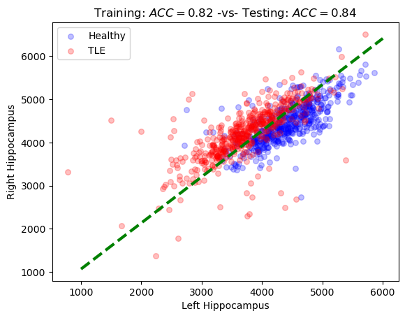

# Logistic Regression for Brain Health Classification

This project implements a logistic regression model **from scratch** to diagnose temporal lobe epilepsy (TLE). The model is trained and evaluated on neuroimaging-derived features, achieving a testing accuracy of 80%.

## Highlights

<table>
<tr>
<td>

- Implemented logistic regression from scratch using NumPy
- Achieved comparable testing accuracy to scikit-learn
- Applied grid search for hyperparameter with cross-validation
- Designed reusable functions for training and evaluating the model

</td>

<td>

</td>

</tr>
</table>

## Technical Skills

- Python, NumPy, Matplotlib
- Logistic regression
- Regularization
- Hyperparameter tuning
- Stochastic gradient descent

## Main Content

- [`logistic_regression.ipynb`](https://github.com/hengyi-liu1/logistic-regression/blob/main/logistic_regression.ipynb) – Project implementation

## How to Run

1. Clone the repository:
   ```bash
   git clone https://github.com/hengyi-liu1/logistic-regression.git
   ```
2. Install dependencies:
   ```bash
   cd logistic-regression
   pip install -r requirements.txt
   ```
3. Open `logistic_regression.ipynb` in Jupyter Notebook or VS Code
4. Run all cells to reproduce results